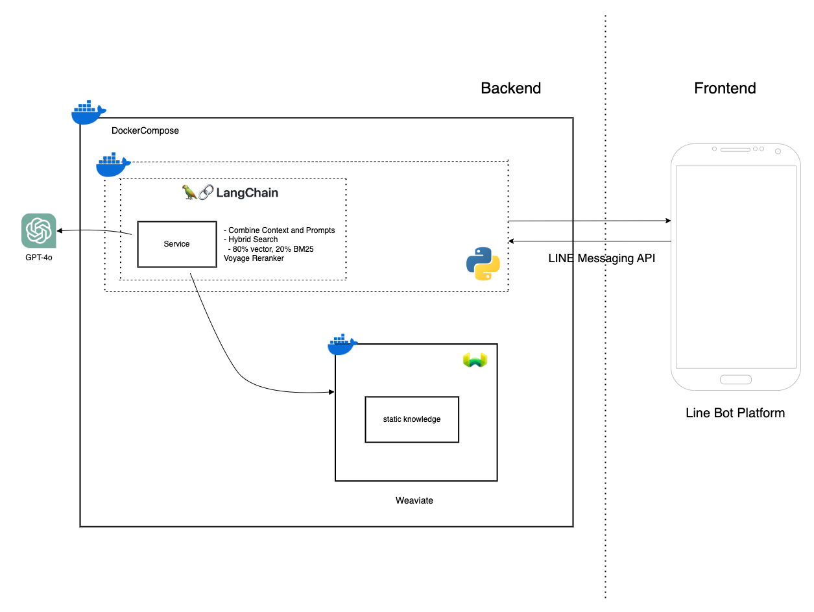

# General RAG Template

### System Architecture
- The frontend here, represented by LINE, is just an example



### Retriever

- Hybrid Search (Stage 1 -> Get Top 100)
    - OpenAI Embedding Model (Semantic search): `text-embedding-3-large` (80% Search)
    - Bm25 (Keyword search): `weaviate gse (jieba)` (20% Search)
- Voyage Reranker (Stage 2 -> Get Top 5)

### Data Preprocess

- Use text_splitter to chunk data with an excessive number of tokens
   - Split into segments of 2000 tokens with an overlap of 500 tokens

## Repo Structure
```
.
├── README.md
├── config.ini
├── data
│   └── README.md
├── docs
│   ├── README.md
│   └── system_diagram.png
├── logs
│   ├── Logger.log
│   └── PLACEHOLDER
├── requirements.txt
└── src
    ├── README.md
    ├── db_insert.py
    ├── rag_service.py
    └── utils
        ├── __init__.py
        ├── ai
        │   ├── __init__.py
        │   ├── call_ai.py
        │   ├── gemini_tem.py
        │   └── gpt_tem.py
        ├── config_log.py
        ├── embedded_weaviate_service.py
        └── weaviate_op.py
```

## Setup Environment

To set up the development environment, follow these steps:

1. git clone our repo:
   ```
   git clone https://github.com/JustinHsu1019/general-rag-template
   cd general-rag-template
   ```

2. Create a virtual environment:
   ```
   python3 -m venv rag_venv
   source rag_venv/bin/activate
   ```

3. Install the required dependencies:
   ```
   pip install -r requirements.txt
   ```

4. Copy the configuration example and create your own config file:
   ```
   cp config.ini config_real.ini
   ```

5. Manually add your `secret key` to the `config_real.ini`:

   - The **api_key** for [OpenAI] can be obtained by registering on the OpenAI official website.  
   - The **api_key** for [VoyageAI] can be obtained by registering on the VoyageAI official website.  
   - The **password** for [Api_docs] can be freely set by the user.  
   - After starting `rag_service.py`, you can directly visit [http://127.0.0.1:5000/](http://127.0.0.1:5000/) to view the Swagger API documentation page.  
   - For [Gemini], if you choose OpenAI as the LLM model, you do not need to configure any value (set values only if you choose to use Google Gemini).  
   - For [Weaviate], you only need to set the `class_name`. You can assign any name, similar to a Collection Name in Firebase.

6. Insert TXT Data into the Database

   Place the required `.txt` file into the `/data` directory and modify the `src/db_insert.py` script as follows:
   ```python
   if __name__ == '__main__':
      manager = WeaviateManager(config.get('Weaviate', 'class_name'))

      # Change 'File_6328.txt' to your desired file name
      with open('data/File_6328.txt', encoding='utf-8') as file:
         content = file.read()

      # Automatically split the text into chunks of 2000 tokens each, with a possible overlap of 500 tokens
      # (avoiding unintended sentence truncation). If the text is already pre-split, you can skip this step
      # and directly create a List (datas variable) for insertion.
      text_splitter = RecursiveCharacterTextSplitter(chunk_size=2000, chunk_overlap=500)
      datas = text_splitter.split_text(content)

      for lines in datas:
         manager.insert_data(lines)
   ```

7. Insert Data into Weaviate

   Run the following command to insert data into the Weaviate database. The Weaviate DB will start automatically with this script and shut down after the process completes. Re-running `rag_service.py` will restart the database. There is no need to use Docker or other tools to open/create the database.  

   ```bash
   python3 src/db_insert.py
   ```

8. Retrieval in the Current Workflow

   Currently, the retrieval process employs **Stage-1** for Hybrid Search and **Stage-2** for Reranker. Refer to `src/utils/weaviate_op.py`:
   ```python
   def search_do(input_):
      # Control the number of top-scoring results retrieved by Hybrid Search (default is 100)
      HYBRID_SEARCH_NUM = 100

      # Control the number of results post-reranking to include in the Prompt for LLM (default is 5)
      RERANKER_NUM = 5

      # Search strategy: 80% Vector Search, 20% Hybrid Search
      # (Based on empirical results, an 8:2 ratio provides optimal results)
      alp = 0.8
   ```

9. Run the Flask App
   To run the service, execute the following command.  
   - Access the API Docs at `/` with the username `rag` and the password configured in `config_real.ini`.  
   - Use `/api/chat/` as the endpoint for the service API.  

   ```bash
   python3 src/rag_service.py
   ```

---

### Source Code Overview

#### RAG Generation Section

1. **Prompt Modification**  
   Modify the prompt in `src/utils/ai/call_ai.py`. This script acts as an abstraction layer for calling LLMs. Choose between GPT or Gemini models (default is GPT).

2. **LLM Third-Party API Calls**  
   - GPT: `src/utils/ai/gpt_tem.py`  
   - Gemini: `src/utils/ai/gemini_tem.py`

#### RAG Retrieval Section

1. **Database Initialization and Data Insertion**  
   Handle database initialization and insert data via `src/db_insert.py`. By default, the database contains two fields: `uuid` and `content` (modifiable). Refer to the [Weaviate v4 Docs - Objects](https://weaviate.io/developers/weaviate/manage-data/create) for details.

2. **Data Retrieval and Re-ranking**  
   Hybrid Search for retrieval and Voyage Reranker for re-ranking are handled in `src/utils/weaviate_op.py`. Focus on the `search_do()` function to adjust:  
   - The number of results retrieved.  
   - The balance between semantic and keyword search (Hybrid Search ratio).  
   Refer to the [Weaviate v4 Docs - Hybrid Search](https://weaviate.io/developers/weaviate/search/hybrid) for detailed explanations.
